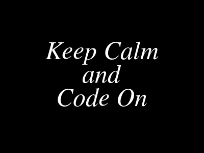

# imagemagick-cheatsheet
Demonstrates how to create simple images using [ImageMagick](https://imagemagick.org/)

## Install ImageMagick

macOS

    brew install imagemagick

## Make an image with text and bg color

    convert -size 400x300 -background black -fill white -family Times -pointsize 50 -gravity center label:'Keep Calm\nand\nCode On' keepcalmcodeon.png

 keepcalmcodeon.png

## Add text to given image

    convert pattern.jpg -fill red -stroke black -font Courier-Bold -pointsize 50 -gravity center -annotate +0+0 'Keep Calm\nand\nCode On' keepcalmcodeon2.png

 pattern.jpg

 keepcalmcodeon2.png

## How to specify color

In brief:
 - white, black, red, blue, ...
 - '#00FF00' (#RRGGBB)
 - 'rgb(0,255,0)'

For more detail:
 - Refer to [this site](https://imagemagick.org/script/color.php)

## List available fonts and font families

You can check which font/family is available on your system.

    mogrify -list font

Simplified result from my iMac :

    Path: /usr/local/Cellar/imagemagick/7.0.10-25/etc/ImageMagick-7/type-ghostscript.xml
      Font: Courier
          family: Courier
          style: Normal
          stretch: Normal
          weight: 400
          glyphs: /usr/local/share/ghostscript/fonts/n022003l.pfb
      Font: Courier-Bold
          family: Courier
          style: Normal
          stretch: Normal
          weight: 700
          glyphs: /usr/local/share/ghostscript/fonts/n022004l.pfb
      Font: fixed
          family: Helvetica
          style: Normal
          stretch: Normal
          weight: 400
          glyphs: /usr/local/share/ghostscript/fonts/n019003l.pfb
      Font: Helvetica
          family: Helvetica
          style: Normal
          stretch: Normal
          weight: 400
          glyphs: /usr/local/share/ghostscript/fonts/n019003l.pfb
      Font: Helvetica-Bold
          family: Helvetica
          style: Normal
          stretch: Normal
          weight: 700
          glyphs: /usr/local/share/ghostscript/fonts/n019004l.pfb
      Font: Helvetica-BoldOblique
          family: Helvetica
          style: Italic
          stretch: Normal
          weight: 700
          glyphs: /usr/local/share/ghostscript/fonts/n019024l.pfb
      Font: Times-Bold
          family: Times
          style: Normal
          stretch: Normal
          weight: 700
          glyphs: /usr/local/share/ghostscript/fonts/n021004l.pfb
      Font: Times-BoldItalic
          family: Times
          style: Italic
          stretch: Normal
          weight: 700
          glyphs: /usr/local/share/ghostscript/fonts/n021024l.pfb

